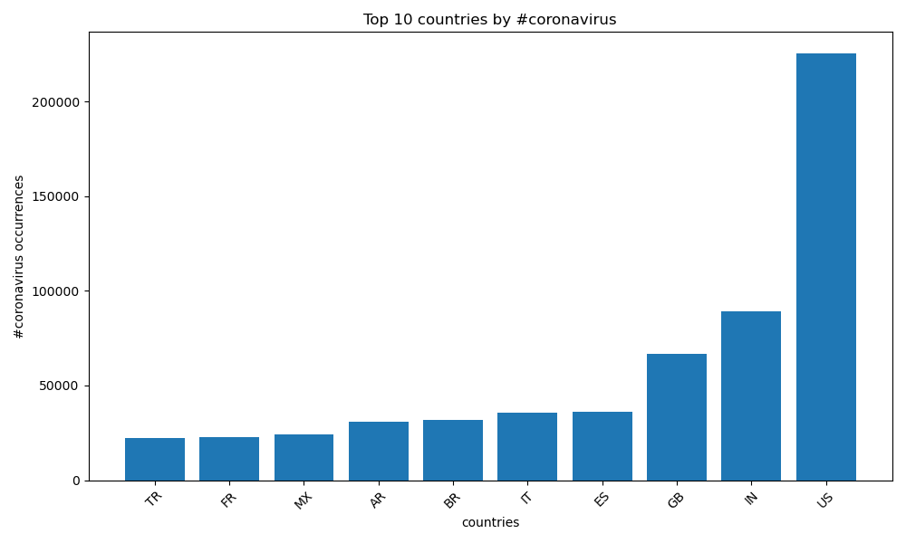
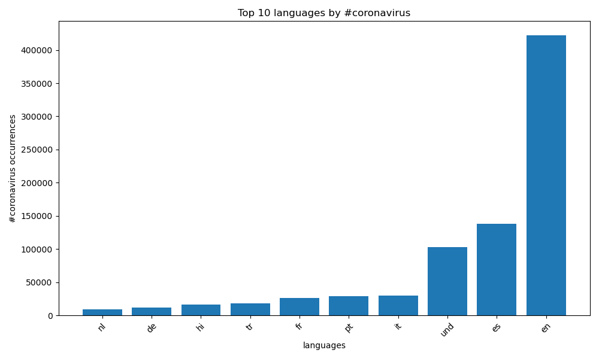
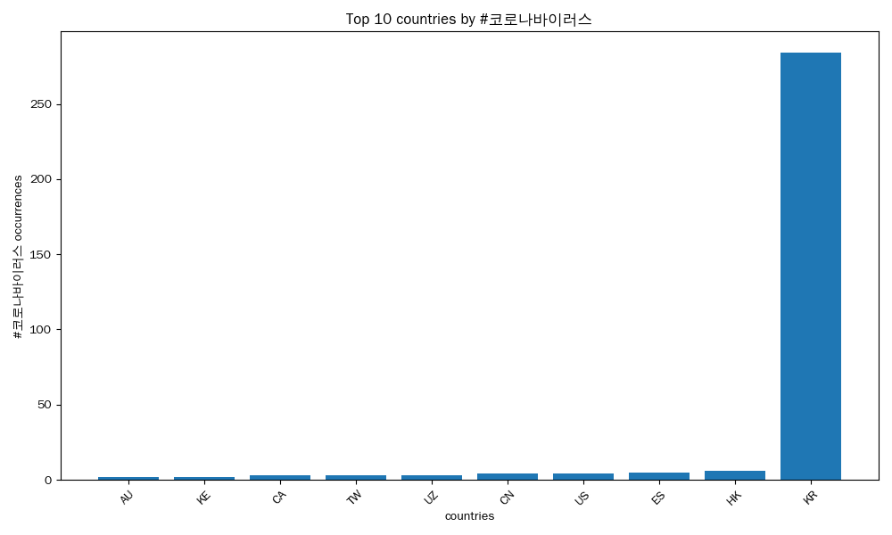
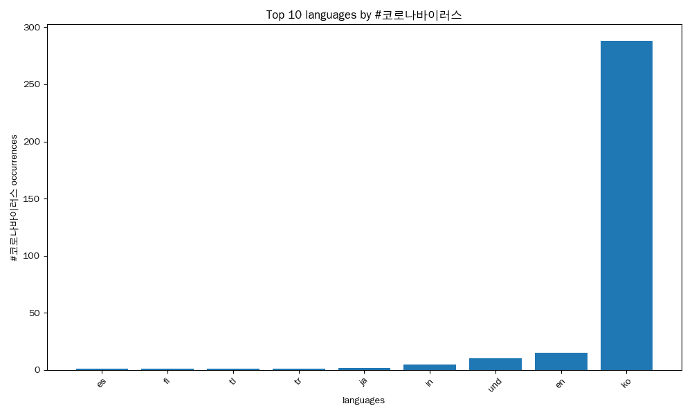
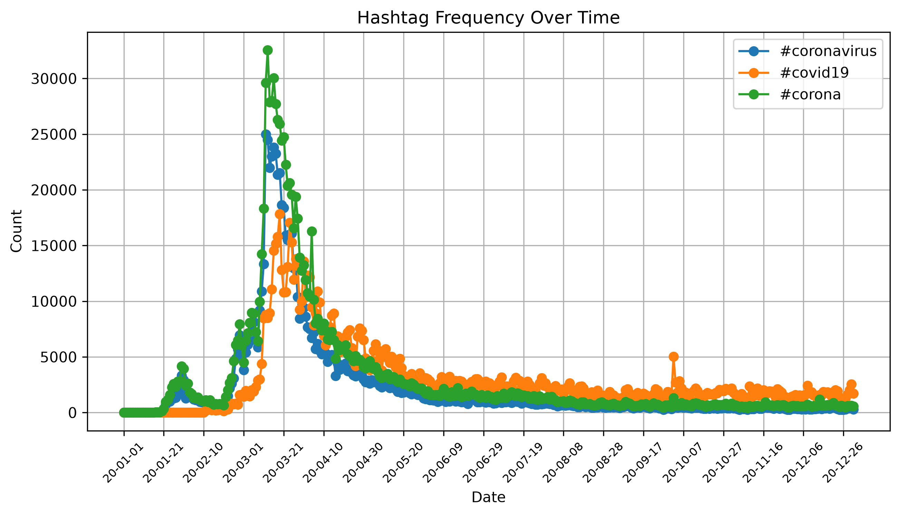

# Twitter Coronavirus Analysis

This project analyzes geotagged Twitter data from 2020 to study how frequently users discussed coronavirus-related topics throughout the year. The project uses a MapReduce workflow to process approximately 2.7 TB of data and identify tweets containing a set of coronavirus-related hashtags.

The mapping step processes each daily Twitter dataset and counts hashtag usage by language and country. The reduce step combines the daily results into yearly totals. I then used Python and Matplotlib to visualize the results and compare the languages and countries associated with selected hashtags.

## Visualizations

### #coronavirus by country

This plot shows the 10 countries with the highest number of tweets containing `#coronavirus` during 2020.

### #coronavirus by language

This plot shows the 10 languages with the highest number of tweets containing `#coronavirus` during 2020.

### #코로나바이러스 by country

This plot shows the 10 countries with the highest number of tweets containing the Korean hashtag `#코로나바이러스` during 2020.

### #코로나바이러스 by language

This plot shows the 10 languages with the highest number of tweets containing the Korean hashtag `#코로나바이러스` during 2020.

## Alternative Reduce

I also implemented an alternative reduce program that analyzes hashtag usage over time. It scans the daily MapReduce outputs and creates a line plot showing the number of tweets containing selected hashtags throughout 2020.

